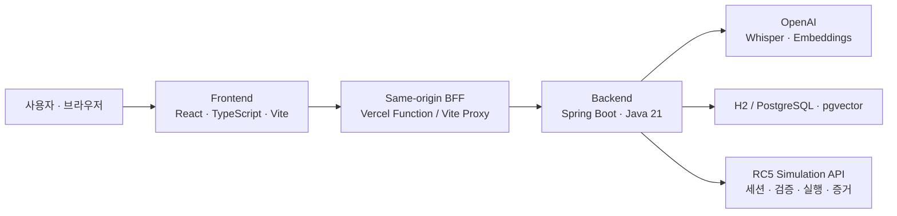

# KioBridge

> 사용자의 표현과 상황에 맞추는 키오스크

**KioBridge는 자연어로 만든 주문표를 표준 입력으로 바꾸고, 사용자가 최종 승인한 뒤에만 키오스크를 대신 조작하는 접근성 주문 브리지입니다.**

[서비스 바로가기](https://kiobridge-app.vercel.app) · [API 상태 확인](https://api.hyunwoocha.site/actuator/health) · [프런트엔드 상세 문서](frontend/README.md)

결제는 다루지 않습니다. KioBridge의 실행 범위는 추천 결과 확인과 사용자 승인, 키오스크 장바구니 담기까지입니다.

## 왜 KioBridge인가요?

KioBridge는 사용자를 대신해 임의로 고르는 서비스가 아닙니다. 사용자가 말한 내용은 확인 가능한 주문표로 바꾸고, 말하지 않은 값은 추측하지 않으며, 안전과 취향이 충돌할 때는 다시 묻습니다.

| 차별점 | 구현 방식 |
| --- | --- |
| **1. 음성으로 만드는 주문표** | `MediaRecorder`로 받은 음성을 BFF와 백엔드를 거쳐 Whisper로 인식합니다. 무음 감지와 15초 자동 종료를 지원하고, 인식 결과는 화면의 보기와 대조한 뒤 확정합니다. 오디오와 발화 원문은 저장하지 않으며 알레르기는 음성이 아닌 직접 선택으로 받습니다. |
| **2. 자유로운 맵기 표현 해석** | “불닭맛”, “얼큰한 맛” 같은 표현을 `text-embedding-3-small`과 pgvector 기반 K-NN으로 `HOT`, `MEDIUM`, `MILD`, `NO_PREFERENCE`에 매핑합니다. 명확한 규칙을 먼저 적용하고, 가까운 앵커 5개 중 3개 이상이 일치할 때만 확정합니다. 모호하면 후보를 보여 주고 다시 묻습니다. |
| **3. 접근성과 취향을 분리** | 큰 글씨·고대비·보조기기 같은 접근성 신호를 사용하되, 장애 정보로 메뉴 취향을 추정하지 않습니다. 뼈/순살 값이 비어 있을 때만 “순살이 편하신가요?”라고 묻고 사용자가 직접 결정하게 합니다. |
| **4. 상황을 보조 신호로 사용하는 추천** | 혼잡 시간대에는 포장 가능한 후보에만 `+0.1` 보조 점수를 주고 추천 이유에 혼잡 시간대를 표시합니다. 평일 점심(11:30-13:00)과 평일·주말 저녁(18:00-20:00)을 서버 시각으로 판단하며, 사용자 선호와 하드 제약이 항상 우선입니다. 실시간 혼잡도 분석은 아닙니다. |

## 시스템 구조



### Frontend

`frontend/`는 주문표 작성부터 QR 연결, 추천 확인, 승인, 실행 결과까지의 사용자 경험을 담당합니다.

| 경로 | 역할 |
| --- | --- |
| [`frontend/src/app`](frontend/src/app) | 주문표, 설정, QR 연결, 추천 확인, 실행 결과 화면 |
| [`frontend/src/api`](frontend/src/api) | 목/실서버 API 계약, 음성·맵기·계정·세션 연동 |
| [`frontend/src/domain`](frontend/src/domain) | 장소별 질문과 카탈로그 |
| [`frontend/api/bff.ts`](frontend/api/bff.ts) | 브라우저 요청을 백엔드로 전달하는 same-origin BFF. 허용 경로·메서드·본문 크기를 제한하고 필요한 Bearer 헤더만 전달 |
| [`frontend/vercel.json`](frontend/vercel.json) | `team` 모드 빌드, BFF rewrite, SPA fallback, 보안 헤더 |

기본 `dev`/`build`는 목 백엔드를 사용합니다. `dev:team`/`build:team`은 실제 백엔드를 사용하며, 어떤 구현을 쓸지는 Vite의 `team` 모드가 결정합니다. 공개용 `VITE_*` 환경변수로 백엔드 주소를 노출하지 않습니다.

### Backend

`backend/`는 입력 정규화, 후보 필터링과 추천, 사용자 승인, 실행계획 조립, RC5 호출, 실행 증거 요약을 담당합니다.

| 모듈 | 역할 |
| --- | --- |
| `modules/voice` | Whisper 기반 음성 인식 |
| `modules/spicylevel` | 규칙 우선 처리 + 임베딩/pgvector K-NN 맵기 매핑 (`vector` 프로필) |
| `modules/inputnormalization` | 화면 입력을 표준 프로필과 세션 컨텍스트로 정규화·검증 |
| `modules/recommendation` | 하드 제약으로 후보 제거, 점수 계산, 추천 결과 검증 |
| `modules/executionplan` | 사용자 승인 이후에만 RC5 실행계획 생성 |
| `modules/pairing` | 실제 RC5 세션을 숨기는 단명 `pairingId`, 입력 고정, 일회성 실행 보장 |
| `orchestrator` | 추천·승인·실행계획을 `ParticipantSubmission`으로 조립하고 RC5 제출 → 검증 → 실행을 연결 |
| `modules/stateevidence` | RC5의 Evidence/Run 결과를 화면용 요약과 실행 단계로 변환 |
| `modules/member` | 선택적 회원가입·로그인과 주문표 동기화 |

기본 `local` 프로필은 H2를 사용합니다. `prod`는 PostgreSQL과 Flyway를 사용하며, 임베딩 기반 맵기 매핑은 PostgreSQL + pgvector를 사용하는 `vector` 프로필에서 활성화됩니다.

### RC5

RC5는 이 저장소에 포함되지 않은 외부 Simulation API입니다. 기본 주소는 `http://localhost:4000`이며 백엔드의 [`SimulationApiClient`](backend/src/main/java/com/kiobridge/kiobridge/contracts/client/SimulationApiClient.java)가 다음 계약을 호출합니다.

```text
세션 생성 → 제출(ParticipantSubmission) → 검증(dry-run) → 실행 → Evidence/Run 반환
```

- 검증에 실패하면 실행하지 않습니다.
- 브라우저에는 실제 `rc5SessionId`를 보내지 않고 256비트 난수 `pairingId`만 보냅니다.
- `pairingId`는 5분 뒤 만료되고, 최초 정규화 입력과 다른 승인 요청은 거부됩니다.
- 하나의 요청만 원자적으로 실행 상태에 진입하며 성공·실패·예외와 관계없이 연결을 즉시 폐기합니다.
- 실제 QR이 없는 MVP에서는 스캔 결과를 고정 claim code로 대체하지만, QR 화면과 연결 상태 관리는 동일하게 동작합니다.

## 처리 흐름

1. 사용자가 터치 또는 음성으로 주문표를 작성합니다.
2. 프런트가 입력을 표준 프로필과 세션 컨텍스트로 정규화합니다.
3. QR 연결 시 백엔드가 RC5 세션을 만들고 브라우저에는 단명 `pairingId`만 반환합니다.
4. 백엔드가 알레르기·품절·이용 불가 같은 하드 제약을 먼저 적용한 뒤 후보를 추천합니다.
5. 확신도가 낮거나 입력이 모호하면 사용자가 직접 후보를 다시 확인합니다.
6. 사용자가 추천 이유와 변경 사항을 확인하고 승인합니다.
7. 승인 이후에만 실행계획을 만들고 RC5에서 검증한 뒤 키오스크 장바구니 담기를 실행합니다.

## 로컬 실행

### 준비물

- Node.js 20 LTS 또는 22 LTS
- JDK 21
- 전체 연동 시 별도로 제공되는 RC5 Simulation Kit
- 음성 인식 또는 임베딩 맵기 매핑 사용 시 OpenAI API 키
- `vector` 프로필 사용 시 PostgreSQL과 pgvector 확장

```bash
git clone https://github.com/watTHEBUG/kioBridge.git
cd kioBridge
```

### 1. 프런트만 빠르게 실행하기 (목 백엔드)

백엔드와 RC5 없이 화면과 기본 시나리오를 확인할 수 있습니다.

```bash
cd frontend
npm ci
npm run dev
```

기본 주소: <http://localhost:5173>

### 2. 프런트 · 백엔드 · RC5 전체 연동

세 프로세스가 계속 실행되므로 터미널을 각각 사용합니다. RC5가 먼저 떠 있어야 백엔드가 세션·계약 API를 호출할 수 있습니다.

```bash
# 터미널 1: 별도 RC5 Simulation Kit (:4000)
cd <RC5_KIT>
npm run start:api

# 터미널 2: KioBridge Backend (:8080)
cd backend
./gradlew bootRun

# Windows PowerShell에서는 다음 명령을 사용합니다.
# .\gradlew.bat bootRun

# 터미널 3: 실제 백엔드 모드 Frontend (:5199)
cd frontend
npm ci
npm run dev:team
```

연동 점검은 `frontend/`에서 실행합니다.

```bash
npm run check:backend
npm run check:pairing
```

### 3. 음성 인식 사용하기

`local` 프로필에서도 서버는 API 키 없이 기동되지만 음성 인식을 호출하면 `STT_NOT_CONFIGURED`를 반환합니다. 실행 전에 키를 환경변수로 전달하세요.

```bash
# macOS / Linux
export OPENAI_API_KEY="your-api-key"

# Windows PowerShell
$env:OPENAI_API_KEY="your-api-key"
```

### 4. 임베딩 기반 맵기 매핑 사용하기

로컬 PostgreSQL에 `kiobridge` 데이터베이스와 pgvector 확장을 준비한 뒤 `vector` 프로필로 실행합니다. 현재 [`application-vector.yaml`](backend/src/main/resources/application-vector.yaml)의 기본 접속값은 `localhost:5432`, 사용자/비밀번호 `sa`/`sa`입니다.

```bash
# macOS / Linux
export SPRING_PROFILES_ACTIVE=vector
export OPENAI_API_KEY="your-api-key"
./gradlew bootRun

# Windows PowerShell
$env:SPRING_PROFILES_ACTIVE="vector"
$env:OPENAI_API_KEY="your-api-key"
.\gradlew.bat bootRun
```

## 환경변수

### Frontend / BFF

| 변수 | 기본값 | 설명 |
| --- | --- | --- |
| `KIOBRIDGE_API_BASE` | 개발 프록시: `http://localhost:8080` | Vite 개발 프록시와 Vercel BFF가 전달할 백엔드 주소. **Vercel에서는 필수**이며 `VITE_` 접두사를 붙이지 않습니다. |
| `KIOBRIDGE_DISABLE_PROFILE_SYNC` | 미설정 | `1`이면 BFF의 주문표 동기화·계정 삭제 경로를 닫습니다. 추천과 실행 흐름은 유지됩니다. |

`team` 모드는 환경변수가 아니라 npm 스크립트가 결정합니다.

| 명령 | 연결 대상 |
| --- | --- |
| `npm run dev`, `npm run build` | 목 백엔드 |
| `npm run dev:team`, `npm run build:team` | 실제 백엔드 |

### Backend

| 변수 | 기본값 | 설명 |
| --- | --- | --- |
| `SPRING_PROFILES_ACTIVE` | `local` | `local`, `prod`, `vector` 중 실행 프로필 |
| `SERVER_PORT` | `8080` | 백엔드 포트 |
| `OPENAI_API_KEY` | 빈 값 | Whisper STT 키. `vector` 프로필에서는 임베딩에도 사용하므로 필수 |
| `OPENAI_STT_CONNECT_TIMEOUT_MS` | `5000` | Whisper 연결 제한 시간(ms) |
| `OPENAI_STT_READ_TIMEOUT_MS` | `15000` | Whisper 응답 제한 시간(ms) |
| `SIMULATION_API_BASE_URL` | `http://localhost:4000` | RC5 Simulation API 주소 |
| `SIMULATION_API_CONNECT_TIMEOUT_MS` | `3000` | RC5 연결 제한 시간(ms) |
| `SIMULATION_API_READ_TIMEOUT_MS` | `10000` | RC5 응답 제한 시간(ms) |
| `SPRING_DATASOURCE_URL` | 없음 | `prod` 프로필 PostgreSQL JDBC URL |
| `SPRING_DATASOURCE_USERNAME` | 없음 | `prod` 프로필 DB 사용자 |
| `SPRING_DATASOURCE_PASSWORD` | 없음 | `prod` 프로필 DB 비밀번호 |
| `CORS_ALLOWED_ORIGIN` | `http://localhost:5173` | 직접 브라우저 호출을 허용할 Origin. 일반 배포는 same-origin BFF를 사용 |
| `AUTH_SESSION_TTL_SECONDS` | `28800` | 로그인 세션 유효 시간(초) |
| `KIOBRIDGE_TEAM_ID` | `WHATTHEBUG` | RC5 제출물의 팀 식별자 |
| `KIOBRIDGE_INPUT_CONTRACT_VERSION` | `1.0.0` | RC5 입력 계약 버전 |
| `KIOBRIDGE_SUBMISSION_VERSION` | `1.0.0` | RC5 제출 버전 |

Spring Boot는 `.env` 파일을 자동으로 읽지 않습니다. [`backend/.env.example`](backend/.env.example)을 참고해 셸, IDE 실행 설정, Docker 또는 배포 플랫폼에서 환경변수를 주입하세요.

## 빌드와 테스트

```bash
# Frontend
cd frontend
npm ci
npm run typecheck
npm test
npm run build:team

# Backend
cd ../backend
./gradlew test
./gradlew clean bootJar
```

외부 OpenAI API와 로컬 PostgreSQL이 필요한 테스트는 `./gradlew externalTest`로 분리되어 있습니다.

## 배포 주소

| 구분 | 주소 | 비고 |
| --- | --- | --- |
| Frontend | <https://kiobridge-app.vercel.app> | Vercel, `npm run build:team` |
| Backend API | <https://api.hyunwoocha.site> | Spring Boot API |
| Backend Health | <https://api.hyunwoocha.site/actuator/health> | Actuator health endpoint |
| RC5 | 공개 주소 없음 | 별도 Simulation API. `SIMULATION_API_BASE_URL`로 연결 |

배포 시 Vercel의 서버 환경변수 `KIOBRIDGE_API_BASE`를 백엔드 주소로 설정해야 합니다. 백엔드 컨테이너는 [`backend/Dockerfile`](backend/Dockerfile)로 빌드할 수 있으며 `prod` 프로필에서는 PostgreSQL 환경변수가 필요합니다.

## 안전 원칙

- 말하지 않은 값을 임의로 채우지 않습니다.
- 알레르기·품절·이용 불가 후보는 순위를 낮추는 대신 후보에서 제거합니다.
- 추천 이유와 변경 사항을 보여 준 뒤 사용자가 승인해야 실행합니다.
- 승인 전에는 실행계획을 만들지 않습니다.
- 검증에 실패하면 RC5 실행을 건너뜁니다.
- 실제 RC5 세션 ID를 브라우저에 노출하지 않고, 후보 식별자는 화면에 불투명 토큰으로만 표시합니다.
- 음성 오디오와 발화 원문을 저장하지 않습니다.
- 키오스크 장바구니 이후의 결제 단계는 수행하지 않습니다.

---

Made by **WHATTHEBUG** for 2026 STARTUP YOUNG GROUND · MVP HACKATHON.
